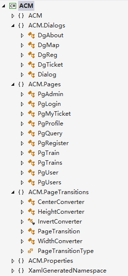
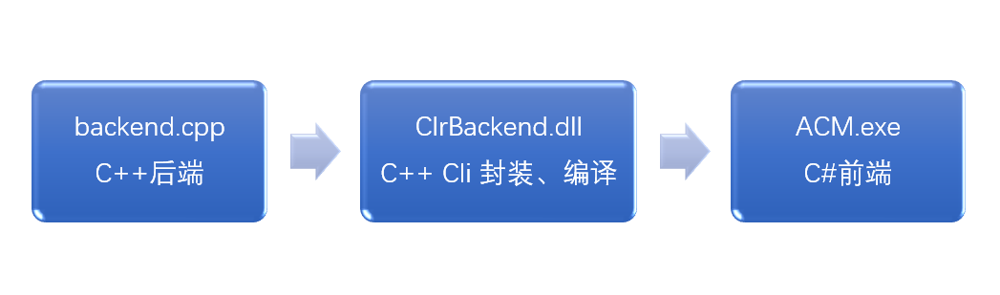
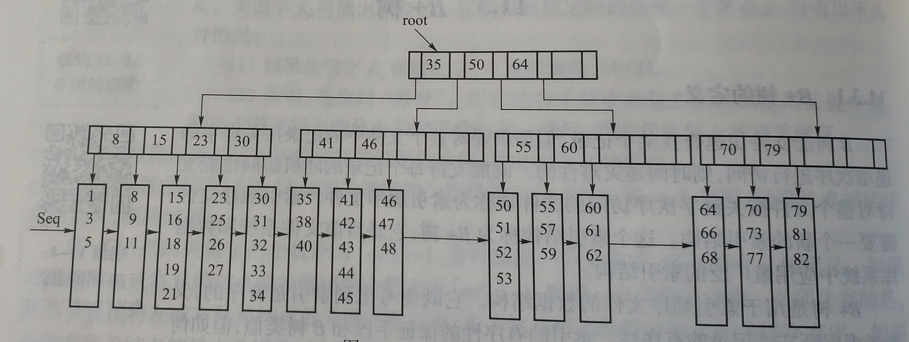

# ACM

ACM，全名Amazing Choochoo Mogician，奇妙的火车膜法师。他出生于ACM班2018年的数据结构课上，隐藏在交大校园里，控制着火车票时空使命。

他的背后有四位兢兢业业的程序员：汪伟杰，曾比扬，张文涛，姜卫邦。


## 一 开发分工

### 1 具体功能

普通用户：注册、登录、修改信息，查票、订票，确认已经订过的票、退票；

管理员：普通用户的所有功能，提升普通用户为管理员，添加修改删除发售车次。

### 2 任务分配

鉴于本次作业的各种要求和任务，我们小组有如下的分工细则：

 |    姓名    | 角色 |                 任务                |
 | --------- | ---- | ----------------------------------- |
 | **汪伟杰** | 组长 | 前端桌面GUI以及相应的前后端通信       |
 | **曾比扬** | 组员 | 后端的架构设计和封装完善，网页端辅助   |
 | **张文涛** | 组员 | 后端B+树，网页端主力                 |
 | **姜卫邦** | 组员 | 后端其他基础结构和基本实现，部分UI设计 |

于是乎，这样定下任务分工后，小伙伴们就愉快地开始了写代码的~~苦力活~~游戏了。

## 二 项目实现

具体的使用方法与大气的界面欣赏请参见ACM团队出品的《用户手册》。

### 1 桌面GUI

本次的桌面GUI采用C# WPF框架实现。汪同学以前因为兴趣写过几个C#小白GUI，以为这次的作业难不到哪里去，就主动接下了这个GUI全部的活，然后才发现自己入了一个大坑。今天要学触发器，明天要啃写样式，时不时还要忍受傲娇的vs弹出的莫名的 “**未知错误，应用程序中断**”，真是酸爽。

整个程序的所有功能基本在一个窗口中实现，有一个铺满的容器用来放各个页面（Page）。页面里有：PgLogin，PgRegister，PgAdmin，PgUser，PgUsers，PgProfile，PgQuery，PgMyTicket，PgTrain，PgTrains …… 各自的功能在名字中就可以看出来，各页面之间的切换还用上了一些手写的动画。

本程序内几乎所有的控件包括窗口本身都用了样式或模板进行了拆封自定义，另外还有几个自定义的对话框，其中最酷的应该就是模仿真实火车票的订/退票窗口了，可以让用户“全真模拟，在线体验”。除此之外，我们还将程序里的文本进行了封装，提供了中英两种可切换语言的界面。这里是我们GUI的类视图：



最复杂的部分就是前端与C++后端的交互了。汪同学经过百度后采取的解决方案是：用C++ CLi（公共运行时）将后端封装起来，编译成dll文件给C#调用。这里为了适配C++ CLi，各种数据类型的使用都要小心翼翼，比如C#里的string对应System::String^（是不是很丑？），构造List要写成List<T ^> ^l = gcnew List<T ^>(0);（是不是更丑了？）奋战了几百个error还残留了几十个warning后，前后端交互成功啦！



### 2 后端

#### 2.1 类定义

- `User` : 用以记录用户的所有信息，包括id、姓名、权限、手机和邮箱等；
- `Train` : 记录车次的所有信息，包括途径站，时间，票种票价等；
- `Station` ：车站类，用以记录某车次经过的该站的信息；
- `Ticket` ： 记录用户某一次购买的若干张车票，包含车次ID，起始站，到达站和票种信息；
- `mytime` ：时间类；
- `tstring` ：用于数据库存储的定长字符串类型；
- `tokenscanner` ： 用于从字符串或者stdin中读取并分离数据；

#### 2.2 数据库（B+树）的实现

##### 2.2.1 实现思路

B+树的实现思路大同小异，本次实现主要是使用了Wikipedia的实现方法。

> ===Insertion===
>
> * Perform a search to determine what bucket the new record should go into.
> * If the bucket is not full (at most  b - 1 entries after the insertion), add the record.
> * Otherwise, ''before'' inserting the new record
>   ** split the bucket.
>   *** original node has (L+1)/2 items
>   *** new node has (L+1)/2 items
>   ** Move (L+1)/2-th key to the parent, and insert the new node to the parent.
>   ** Repeat until a parent is found that need not split.
> * If the root splits, treat it as if it has an empty parent and split as outline above.
>   B-trees grow at the root and not at the leaves.

> ​	===Deletion===
>
> * Start at root, find leaf ''L'' where entry belongs.
> * Remove the entry.
>   ** If ''L'' is at least half-full, done
>   ** If ''L'' has fewer entries than it should,
>   *** If sibling (adjacent node with same parent as ''L'') is more than half-full, re-distribute, borrowing an entry from it.
>   *** Otherwise, sibling is exactly half-full, so we can merge ''L'' and sibling.
> * If merge occurred, must delete entry (pointing to ''L'' or sibling) from parent of ''L''.
> * Merge could propagate to root, decreasing height.

>===Bulk-loading===
>Given a collection of data records, we want to create a B+ tree index on some key field. One approach is to insert each record into an empty tree. However, it is quite expensive, because each entry requires us to start from the root and go down to the appropriate leaf page. An efficient alternative is to use bulk-loading.
>
>* The first step is to sort the data entries according to a search key in ascending order.
>* We allocate an empty page to serve as the root, and insert a pointer to the first page of entries into it.
>* When the root is full, we split the root, and create a new root page.
>* Keep inserting entries to the right most index page just above the leaf level, until all entries are indexed.
>
>Note :
>* when the right-most index page above the leaf level fills up, it is split;
>* this action may, in turn, cause a split of the right-most index page on step closer to the root;
>* splits only occur on the right-most path from the root to the leaf level.

当然我的实现方式有所不同，我在实现过程中没用像书中介绍的那样间隔存储关键字和记录数据（如下图）：

---



一棵五阶B+树

---

我将磁盘地址记录和关键字合并为一个struct，作为树上的记录。

##### 2.2.2 实现方式

###### 2.2.2.1 B+树的存储实现

>文件结构

本次开发的B+树在运行时共会生成四个文件`.ksxidx`文件，`.ksxdb`文件，`.dbmgr` 文件以及`.idxmgr`文件，其分别对应的是索引文件，数据文件，索引管理文件以及数据管理文件。

>索引文件

存储B+树的节点以及B+树本身的信息，严格4KB读写。

>数据文件

单纯存储数据，没有特殊操作

>管理文件

管理索引文件以及数据文件上的可用空间，防止文件大小增长过快

---

>抽象数据类型

>B+树自身文件信息

---

```C++
private:
    char idxFileName[MAX_FILENAME_LEN]; //文件名
    char idxFileMgr[MAX_FILENAME_LEN];
    char dbFileName[MAX_FILENAME_LEN];
    char dbFileMgr[MAX_FILENAME_LEN];
    OFFSET_TYPE dataSize;//数据库大小
    OFFSET_TYPE rootOffset;//根节点位置、
	BPTNode* currentNode;//常驻内存的根节点
```

---

>B+树节点信息

---

```c++
    struct BPTNode{
        char nodeType = DELETED; //节点类型
        short sz = 0;//节点中数据个数
        OFFSET_TYPE nodeOffset = INVALID_OFFSET; //节点在文件中的位置
        OFFSET_TYPE nextNode = INVALID_OFFSET; //同一层后继节点的位置
        OFFSET_TYPE prevNode = INVALID_OFFSET;//同一层前驱节点的位置
        treeData data[MAX_BLOCK_SIZE];//节点数据
    };
```

---

>节点数据信息

---

```c++
    struct treeData{
        Key k = Key(); //关键字
        OFFSET_TYPE data = INVALID_OFFSET; //文件位置指针
    };
```

---

>读写方式

由于高频次的开关文件以及外存访问成本非常高昂，因此必须很好的优化读写才能使B+树的运行效率变高。在本次B+树实现中主要对索引节点的读取做了4K读写（通过计算使得节点大小接近4KB，提高文件利用效率）。在同样的提条件和同样的数据规模下，进过4K读写优化的B+树可以节省大约一半的时间。

将接近4KB的数据写入一个大小为4KB的`rwBuffer`数组中，然后再写入磁盘。

读写由若干函数完成，这里简单介绍`writeNode()`以及`writeIdx()`函数。

`writeNode()`函数：

```C++
    bool writeNode(BPTNode *p, OFFSET_TYPE offset = 0){
        if(fidx.fail()) fidx.close();
        if(!fidx.is_open()) fidx.open(idxFileName, IOB);
        //确保文件正常开启
        if(offset == 0){
            fidx.seekg(0, std::ios_base::end);
            offset = fidx.tellg();
        }
        p->nodeOffset = offset;
        if(fidx.fail()){
            fidx.close();
            return 0;
        }
        fidx.seekp(offset);
        memcpy(rwBuffer, p, sizeof(BPTNode)); //将待写入数据拷贝到缓冲区
        fidx.write(rwBuffer, sizeof(char) * MAX_BUFFER_SIZE);：
        fidx.flush();
        return 1;
    }
```

---

`writeIdx()`函数：

```C++
    bool writeIdx(){
        if(!fidx.is_open()) fidx.open(idxFileName, IOB);
        fidx.seekp(0);
        OFFSET_TYPE pos = 0;
        memcpy(&(rwBuffer[pos]), idxFileName, sizeof(char) * MAX_FILENAME_LEN);
        pos += sizeof(char) * MAX_FILENAME_LEN;
        memcpy(&(rwBuffer[pos]), dbFileName, sizeof(char) * MAX_FILENAME_LEN);
        pos += sizeof(char) * MAX_FILENAME_LEN;
        memcpy(&(rwBuffer[pos]), &dataSize, sizeof(OFFSET_TYPE));
        pos += sizeof(OFFSET_TYPE);
        memcpy(&(rwBuffer[pos]), &rootOffset, sizeof(OFFSET_TYPE));
        //类似的操作，将数据拷贝到缓冲区，再进行写入
        fidx.write(rwBuffer, MAX_BUFFER_SIZE);
        fidx.flush();
        return 1;
    }
```

而相对`readNode()`以及`readIdx()`函数就是以上两个函数的逆操作，在这里不作解释。

###### 2.2.2.2 B+树的运算实现

>B+树的插入

​	本次开发过程中使用的插入策略是递归的，层层递归找到插入位置，插入数据后对节点合法性进行判断，并进行相应的分裂操作，将这一层的的信息通过结构体 `retVal`返回到上一层，更新上一层的内容。主要由两个函数`treeInsert()` 以及 `treeInsertFirst()`完成。函数可以用伪代码表示：

```
插入(关键字, 数据， 起始节点){
	判断是否为空，如果是则直接在起始节点上插入，然后返回
	若不为空且为内部节点{
		利用二分查找找到进入下一层的位置
		读取这个位置上的节点
		retVal = 插入（关键字，数据，下一层上的节点）
		利用retVal的信息更新这一层
		判断这一层是否需要更新，如需要就执行相应操作
		如果被更新则写入磁盘
		返回这一层的retVal信息
	}
	若不为空且为叶节点{
        利用二分查找找到插入位置并插入
        判断节点是否合法，如果不合法就执行分裂操作
       	写入磁盘
       	返回这一层的retVal信息
	}
}
```

在执行插入操作时我们调用了两个函数，这是由于我的关键字与文件指针地址一一对应，所以插入比最小元素更小的元素时调用`treeInsert()`会解体(~~事实上是因为设计失误并且我不想改。。。~~ )所以就写了另一个`treeInsertFirst()`函数来弥补，但是总体性能还是不受影响的。

>B+树的删除

​	删除和插入的想法基本一致，但是略有不同，插入递归到叶节点，但删除只能递归到根节点上一层的位置，通过`treeRomve()`函数完成，也可以用伪代码来表示。

```
删除（关键字，起始节点）{
    判断树是否为空，空则直接返回
    若起始节点为叶节点{  //这种情况只会在刚开始树上只有一个节点的情况下才会产生
    	利用二分查找找到删除位置并执行删除
    	返回
    } 
    利用二分查找找到进入下一层的位置，读取这个节点
    若读进来的节点是叶节点{
        利用二分查找找到删除位置
       	删除对应节点，并把这个位置记录在可用位置的队列里
       	检查节点合法性，若不合法则执行相应操作
       	如果需要的话 更新当前起始节点
       	将叶节点写入文件
       	将当前节点写入文件
       	利用一个整型返回当前节点执行了什么操作给上一层
    }
    若读进来的节点是内部节点{
        返回值 = 删除(关键字，起始结点) //递归进入下一层
        如果返回值表明当前节点的儿子执行了合并或者借节点的操作{
            如果借了节点 并且 导致了当前节点需要更新{
            	利用还在内存里的儿子更新当前节点
            	将当前节点写入磁盘
            }
            
           如果合并了节点{
               更新当前节点 //由于当前节点的儿子上发生了合并，所以当前节点的规模减少1,所以也需要验证是否需要进行相关操作
               检查节点合法性，若不合法则执行相应操作
               将当前节点写入磁盘
               根据当前节点的进行的操作返回一个值
           }
        }
        如果没有，则直接返回代表什么都没有做的值
    }
}
```


>分裂节点

分裂节点的函数在本次B+树的实现中起到了非常重要的作用。

主要是`splitNode()`函数，这个函数维护了同一层的链以及分类根节点时树的增高与更新，伪代码如下：

```
分裂节点(目标节点){
    如果有的话，读取前驱节点
    如果有的话，读取后继节点
    分配新的节点
    拷贝传入目标节点的一半
    如果需要的话 维护本层的链
   	写入磁盘
   	如果传入的目标节点是根节点{
        建立新节点作为根
        更新B+树信息，写入磁盘。
   	}
   	返回一个retVal配合treeInsert()使用
}
```


>借节点

很简单的函数

```
借节点(目标节点){
    读取后继，判断是否可以接，若可以{
        从后继节点借一个儿子
        返回
    }
    读取前驱，判断是否可以借，若可以{
        从前驱节点借一个儿子
        返回
    }
}
```

##### 2.2.3 开发以及结构优势

* 由于在设计上做了很好的考虑，所以B+树的性能非常优秀。并且由于在`split()`函数中作了处理，使得每层都有一条水平链，可以支持区间查找以及其他一些更复杂的查找。
* 由于在读写节点时做了4K优化，所以性能十分优秀
* 合并了关键字和文件位置指针，使得开发变得容易
* 由于在删除节点后使用了队列以及相关文件记录已占用空间中可用区域的起始位置，所以在正常情况下占用的空间增长速度较慢，空间利用效率高。


#### 2.3 数据的存储

##### 2.3.0 设计理念

可以使用的工具为一个支持一一对应插入修改和删除的数据库，所以设计时尽可能地将所有数据整合成有唯一关键字的一对一的数据进行存储和处理。绝大多数的数据使用B+树实现的`DB`类存储。(以下出现的含DB的变量均为`DB`类)

##### 2.3.1 用户信息

原本采用`DB`存储，但用户并没有删除操作，更改为用更加高效的线性表`fvector`存储。

##### 2.3.2 车次信息

对于车次本身的信息存储于`trainDB`中,同时将所有可能的路线存入`routeDB`。为了实现带中转查询操作，将出现过的车站存储于`staDB`中。

##### 2.3.3 车票信息

对于用户购买的车票存入`ticketDB`，每个车次每天的余票存储于`train_ticDB`中。

#### 2.4 操作的实现

##### 2.4.1 用户操作

直接在对应的线性表中进行插入和修改操作。

##### 2.4.2 车次操作

进行添加车次操作后在对应的train数据库中加入对应车次的信息，修改和删除操作也对应的在数据库中修改数据。

在进行发售操作后，由于发售后保证不更改车次信息，在车次进行发售操作后将列车所有可能的路线将起始站和到达站以及车次的ID结合，作为一个复合关键字加入route数据库中。

##### 2.4.3 车票操作

用户查询车票时，就可以将所查询的出发站和到达站结合，分别接上最小可能的车次ID和最大可能的车次ID，使用数据库的区间查找操作找到所有满足条件的车次的ID，并在`trainDB`中找到ID对应的信息并进行输出。

在用户购票后，以用户此次购买的车票构建一个对应的`Ticket`类，以用户ID和日期、catalog和从1开始生成的唯一的TicketID为复合关键字存入`ticketDB`中。同时在`train_ticDB`中以车次ID和日期为复合关键字维护对应的余票信息。

查询购票信息时就可以用查询车票类似的放法，以所查询的用户ID、日期、catalog为复合关键字查找满足条件的所有车票。退票时在数据库中找到对应内容删除。

带中转查询使用的是枚举中转站进行查询车票的方法。

### 3 网页端

调完后端后，学有余力的张同学担起了写一个网页端的任务，该网页端基于flask框架。目前在曾同学的配合下，这个网站已经实现了所有用户界面的功能，界面清丽有特色，你可以去[肥宅快乐订票站](http://www.hzfengsy.ml)体验一番哦！


## 三 组员总结和吐槽

***

### 汪伟杰

为了提升GUI的B格，我还特地找了一些诗放上去，可是似乎效果一般。

VS的调试真是一个超级大坑，对于这种两种语言混合编程的项目，要打开一堆奇奇怪怪的符号/选项才能完成断点和变量查看，接着就有了每次Debug都要等好几秒加载符号的时间。

对自己的美工设计能力太失望了，本来希望自己能写出像迅雷那样优雅酷炫的界面，结果丑成了那样。。。

几位队友大家都辛苦了！

***

### 姜卫邦

**我在本次大作业中主要负责通过后端评测。**

在本次大作业中，我学会了如何将一个很大的问题分散成一些小问题来解决，又如何将这些一个个的操作连在一起。

我首先遇到的一个困难是如何高效率地实现查票操作，我思考通过把经过出发地的列车枚举出来，在这些列车中查找是否经过目的地，但这样的方法似乎比较费时。于是我询问我们的A班组员曾比杨同学，他告诉了我一种较快的实现方法，提高了查票操作的效率。

在写完后端后，我又遇到了调试的困难。由于是文件输入，使得调试起来比较麻烦，花费了我较多时间。最后终于调试成功。

**这次大作业使我获益匪浅。**