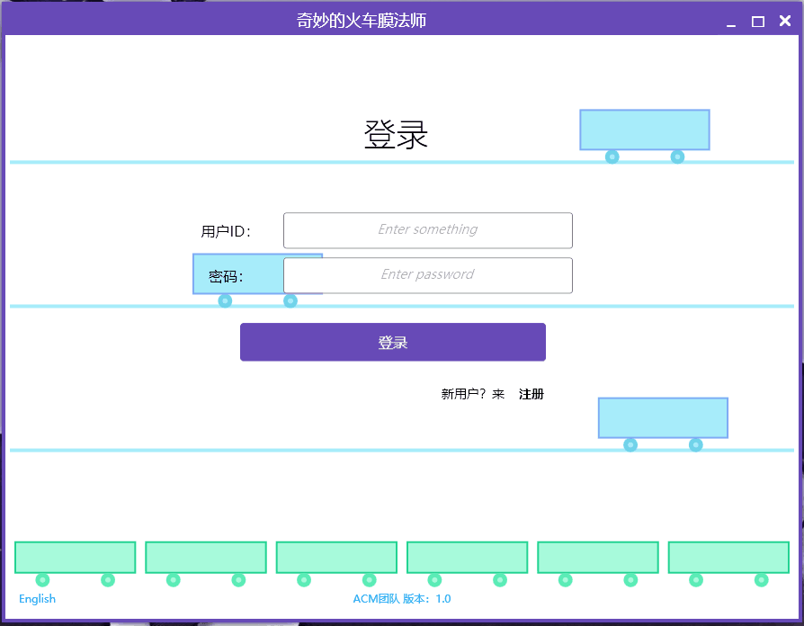
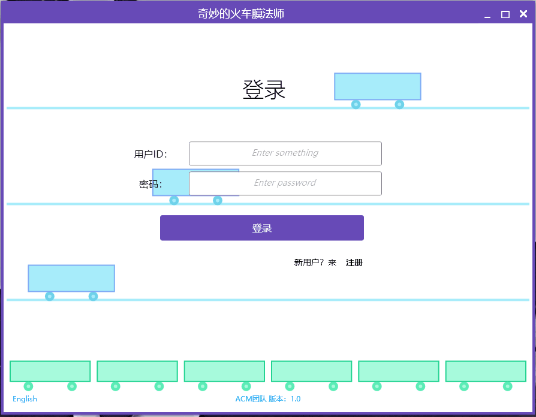
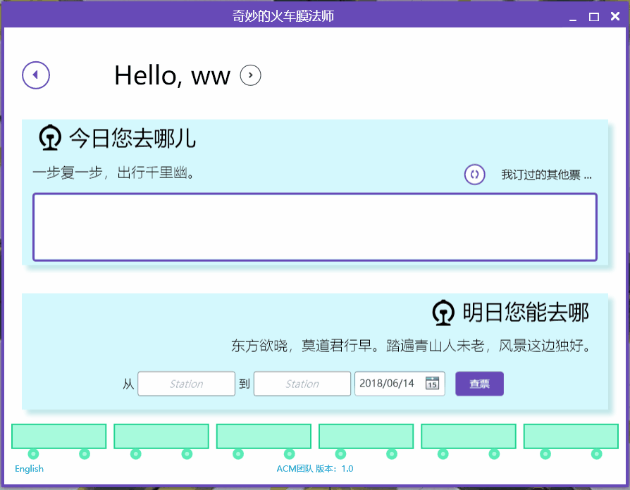
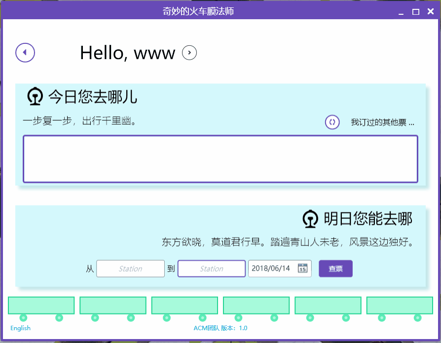
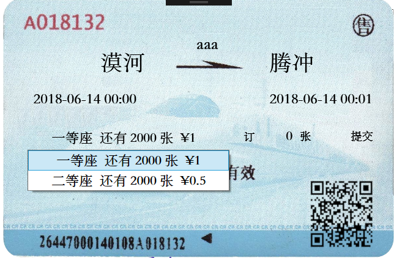
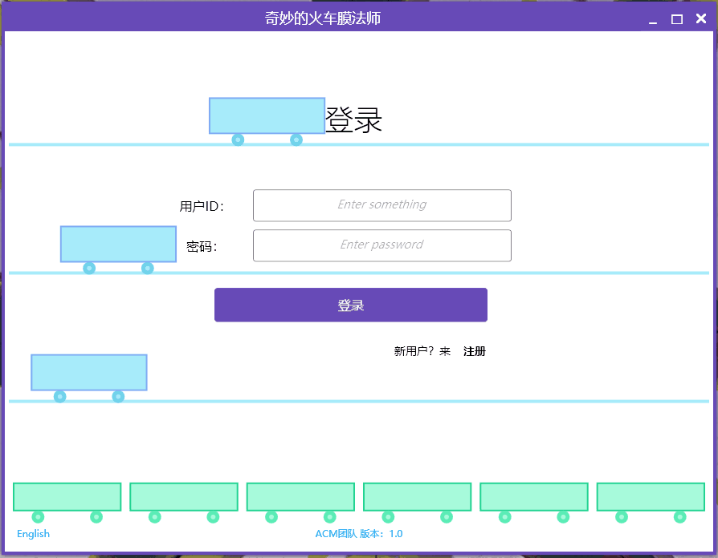
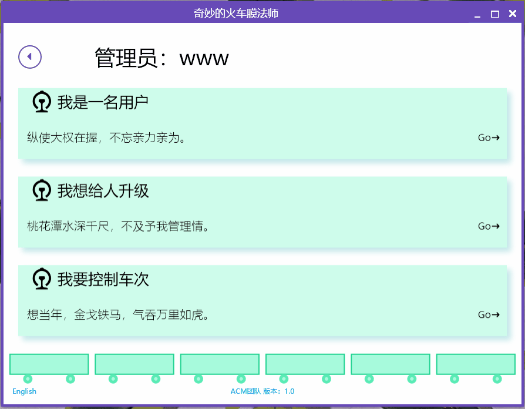
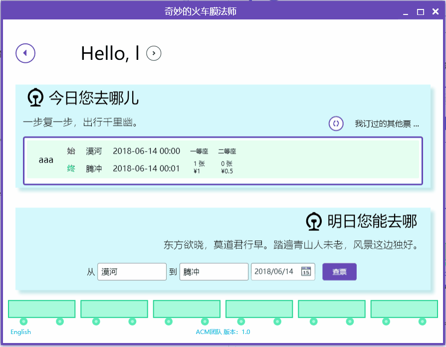

# GUI使用手册

本用户手册演示 奇妙的火车膜法师 GUI端的使用方法。

## 1.普通用户

- 注册

新小白来了后当然要先注册啦。

值得注意的是，用户名不得超过6个字符（一个汉字算一个字符），密码不要超过20位，其余细则在你注册失败后把鼠标移到输入框后面的红点上就知道啦！

注册成功了后你可以选择直接登录或者返回登录界面。

- 登录

登录界面清新淳朴，记得是用户ID而不是用户名登录就好。

- 修改资料

注册时填写的信息当然可以修改啦（系统指定的用户ID除外），此界面类似注册界面。

- 查票、订票和退票

普通用户登录后的界面有两个部分，上面显示的是今天将要派上用场的票，也可以进一步查看自己订过的票，必要时可以退票；下面是快捷查票入口，可以根据自己的需求订票。

注意，在那个类似火车票的对话框里，可将鼠标移至右上方的“售”字上关闭窗口，中间左边的票类信息是可以选择的。

还有，当你失恋了想订票回家找妈妈却忘了自己老家的车站名时，别忘了使用地图功能帮你记起老家的车站！

提示：使用本功能时要联网。

## 2.管理员

最酷的当然还是掌握生杀大权的管理员啦。两面派的管理员既可以装孙子成为普通用户买票退票，也可以摇身一变成为你大爷。不信你看——

- 提升普通用户权限

很实用的功能，也是很多人抱管理员大腿的原因。

- 管理车次

这里涉及到的有车次的添加、修改、删除、发售。注意，发售后的车次就不能再修改、删除了（也就是说系统会告诉你操作失败）。

关于车次的添加，这里有一些格式要求：

1.车次ID，车次名称不要超过10个字符（一个汉字算一个字符）；

2.车站名不要超过6个字符（同上）；

3.票价为一个小数，如3，3.0，0.3都是合法的票价；

4.时间格式为XX:XX，请输入合法的时间，不然会有惊吓（用户查不到票）哦！

## 3.无边的膜力

介绍到这里，就不得不说说本膜法师的膜力了。

- 放大的脸

看清楚这张放大了的图标，我赌你没有看出那辆火车身上的“a”“c”“m”三个字母。

- 针对西方记者用户

一个合格的膜法师当然要能和西方记者们谈笑风生，所以来看看他怎么变身为“假洋人”的吧！

如何？愉快地开始你的使用吧！