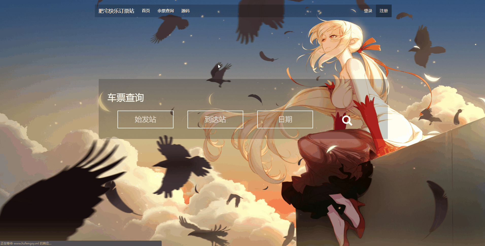
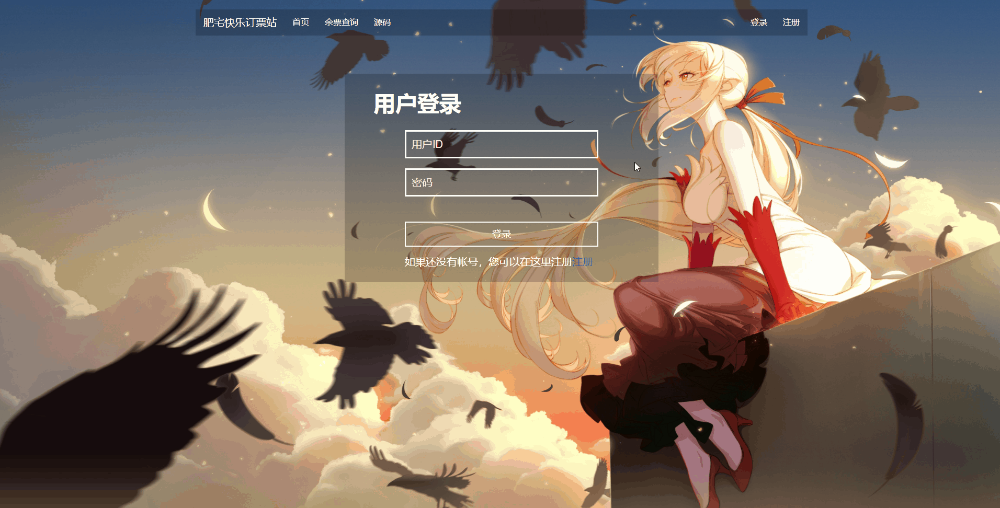
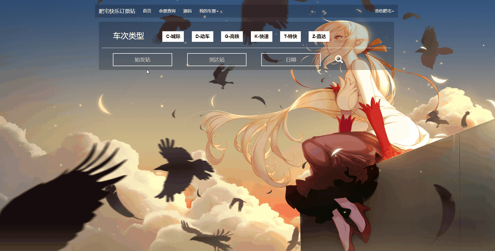
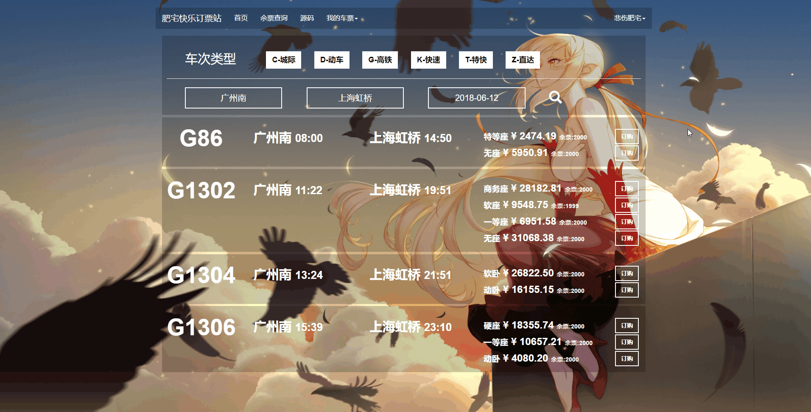

#用户手册

本用户手册介绍的是[肥宅快乐订票站](http://www.hzfengsy.ml)的使用方法
##1. 用户相关
- 用户注册

- 用户登录

登录后进入个人空间界面

- 个人信息

在个人空间可以查看与更改个人信息

##2. 车票查询
- 查询车票

在搜索框输入对应内容即可查询，在上方可以勾选车次种类。

##3.车票管理
- 车票订购

在查询结果界面即可点击购买对应的车票，可以选择购买张数。

- 查看与退票

购买成功后，在个人空间即可查看自己即日起至30天后所购买的所有车票，点击即可选择退订操作。